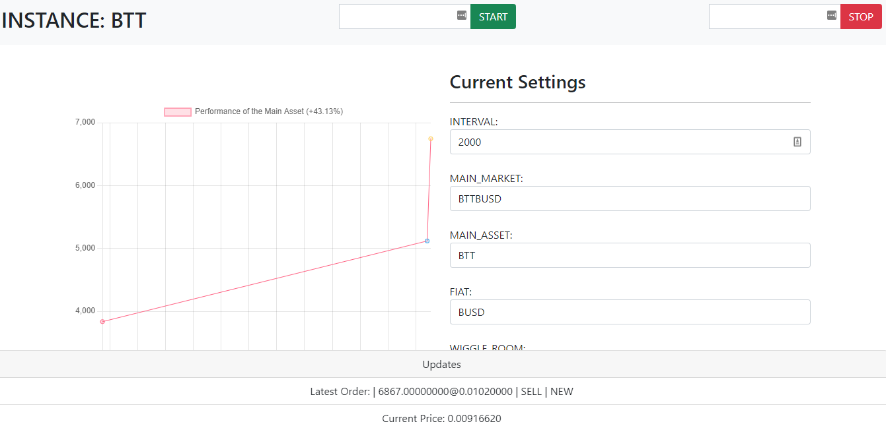

# Binance Trading App (Bot)



This is a Node.js binance trading bot that takes advantage of crypto's volatile prices.

**NB: You will need a Binance account. [Register Here](https://accounts.binance.cc/en/register?ref=77939580)**

## Support

Join Discord channel to ask questions, or create an issue.

Discord Invite: [Join](https://discord.gg/GTfs6pQmXe)

## Caution

⚠️ This is still alpha stuff under active development. Some things might not work as described yet. Also, a lot of changes happening all over the place.

## Theory

The prices of crypto go up and come down very fast, creating a gap of at least 0.5% every 5 minutes or so. That is for the more stable ones, like BTC. The rest even create a gap of up to 1.5% between the highest and lowest prices every 5 minutes! I call that gap WIGGLE_ROOM. 😉

Based on this observation, theoretically, it should be possible to profit from such volatility by picking the mid position of the oscillation, that is, the average price between the highest and the lowest prices of the 5 minutes, then subtract half of the WIGGLE_ROOM when buying, and add a half of the WIGGLE_ROOM when selling. Easy. But it is not, accuracy of this is very small. But have faith.

## Possible Risks

If you place an order at the bottom of the curve by mistake, the graph can continue moving up and you are left there, all alone. In such a case, when a few minutes expire and the order is not even partially filled, if it is a BUY order, cancel it altogether.

When the graph is already at the top of the oscillation when buying, even though we guard against this by doing averages, the selling price will be untouchable. So you have to sit and wait until the curve is high enough again so you can sell to remain profitable, this can mean a pause longer than a day.

At the moment, it is not possible to just cancel and place it anywhere else for the sake of it, the bot is not accepting losses yet. Until it can, we have to sit and wait.

Also, when the main asset tanks, you will go down with it, however, the tanking is not always very fast, so it is possible to place orders as it goes down unless you bought at the absolute top, which means you will have to sit and wait for a reealy loong time!

## Target

From initial tests, using Binance Backtesting API for futures trading, when the WIGGLE_ROOM is set to 0.3%, the number of trades averages between 2-3 in one hour. This means that considering the fees are 0.1%, you remain with 0.1%*3 which implies that you can make up to 0.3% of 98% of your principal amount every one hour. In 24 hours, if all goes well being overly optimistic, you can make between 4-7% of 98% of your principal. (The 98% comes from trading at least 98% of your mmain asset)

So say you started with 1000 USD, 98% of that is 980USD. Then, 4-7% of that is about 40-70USD each day. Which is decent to be honest.

So far, when the WIGGLE_ROOM is set to 0.5% in the DENTUSDT market, the average return is about 0.6% in 4 hours, translating to around 2-4% each day. Quite decent!

## Future Improvements

- Ability to trade multiple pairs.
- Ability to automatically determine the WIGGLE_ROOM for any given asset at any given time since the curves are not always just small fluctuations but giant leaps at times.
- Ability to take short term losses by selling low so as to keep following the curve.
- Ability to calculate and report profits at different times of the day depending on all the successful trades.
- Make it more configurable, everything should be configured even through an API, not necessarily through the settings file.
- Ability to send notifications to many other channels, e.g. Telegram, Slack
- Ability to consider TA indicators

## Running the Bot

Just edit the `settings.json` file to include your own preferences and your available asset as the main asset then `docker-compose up` or `docker-compose up -d` depending on your kind of medicine.

To run without Docker, edit the `settings.json` file accordingly and then run `npm install` inside the `/bot` folder then `npm run dev`.

Add your suitable settings:

```json
{
    "URL": "https://api.binance.com/api/v3",
    "API_SECRET": "YOUR BINANCE API SECRET", // STRING
    "API_KEY": "YOUR BINANCE API KEY", // STRING
    "WIGGLE_ROOM": 0.5, // FLOAT - THE PERCENTAGE MARGIN YOU ARE WILLING TO PLAY WITH
    "MAIN_MARKET": "BTCUSDT", // STRING - THE MARKET, E.G. BTCUSDT
    "FIAT": "USDT", // DEPENDS ON THE MARKET ABOVE, E.G. USDT
    "MAIN_ASSET": "BTC", // STRING - YOUR MAIN ASSET, E.G. BTC
    "MAIN_ASSET_DECIMALS": 6, // INTEGER - THE NUMBER OF DECIMALS ALLOWED FOR QUANTITY OF THE MAIN ASSET THAT YOU ARE TRADING, E.G. 6 FOR BTC, 3 for testnet
    "CANCEL_AFTER": 300, // After how long in seconds should you cancel an order?
    "INSTANCE_NAME": "BTC", // If you are using the same Discord server to receive notifications from multiple instances, this makes it easy to know which instance is sending you a notification.
    "INTERVAL": 3000, // How long before loop repeats in milliseconds
    "ACCEPTABLE_LOSS": 2, // this is not yet used in the logic
    "HIGHEST_RSI": 70, // INTEGER - HIGHEST RSI VALUE YOU WANT TO AVOID BUY
    "PRECISION": 2, // INTEGER - NUMBER OF DECIMAL PLACES ALLOWED FOR PRICE BY THE TRADING PAIR, E.G. 0.01 FOR BTCUSDT
    "DISCORD": "DISCORD_WEBHOOK_URL", // WHERE TO SEND BUY/SELL NOTIFICATIONS
    "DISCORD_ERRORS": "DISCORD_WEBHOOK_URL_FOR_ERRORS", // WHERE TO SEND ERRORS    
    "TELEGRAM_TOKEN": "", // TELEGRAM TOKEN
    "TELEGRAM_CHATID": "", // TELEGRAM CHATID
    "BUYING_PRICE_DIVIDER": 1, // This default value means the buying price is the current price minus the wiggle room. If you want to buy a little closer to the current price, increase this value. 
    "PIN": 12345 // This is used in the UI. When you change this, you need to restart the bot.

}
```

 :warning: CAUTION for `BUYING_PRICE_DIVIDER`:warning::: YOU WILL LOSE MONEY IF YOU SET A VALUE LESS THAN 1.

## Detailed Installation Instructions

You can run this bot anywhere. This includes on PC, Mac or Linux provided you have node.js (v14) installed if you want to run without Docker.

### Running without docker

- **Step 1**: Install Node.js (tested on v14 LTS)

- **Step 2**: clone the repository and then `cd` into the cloned directory, `cd` into the bot directory and run `npm install`

- **Step 3**: Go to binance and obtain your settings i.e. The API KEY and the API SECRET. Remember that if you are going to be using Binance testnet, you need to use the testnet API_KEY and SECRET associated with your testin account at [https://testnet.binancefuture.com](https://testnet.binancefuture.com). If you use the main Binance site, use the API_KEY and SECRET associated with your trading account.

- **Step 4**: Decide whether to use Binance backtesting API (testnet.binancefuture.com, recommended) or the main site (api.binance.com, only when sure should you do this). If you are going to use testnet, the URL value of the settings.json file should be: `"https://testnet.binancefuture.com/fapi/v1"`. Else use `"https://api.binance.com/api/v3"`.

- **Step 5**: Edit other settings accordingly (Check the decimals here: [https://www.binance.com/en/trade-rule](https://www.binance.com/en/trade-rule))

- **Step 6**: Run `npm run dev`
